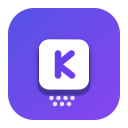

# KeyAtlas – Shortcut Search Engine

<div align="center">



**离线、即时、跨平台的快捷键搜索引擎**

[English](#) · [中文](#)

[](#)
[](#)
[](#)

</div>

---

## Overview

**KeyAtlas** is a fully offline, lightweight Chrome extension (Manifest V3) that helps you instantly find keyboard shortcuts for your operating system, design tools, development IDEs, office suites, and hundreds more — all without an internet connection or backend server.

Bilingual (English / 中文) out of the box. Works on Windows, macOS, and Linux.

---

## Features

### 🔍 Smart Search
- Fuzzy, weighted search across **5000+ shortcuts** (153 apps/systems)
- Matches by: action name, description, keywords, app name, pinyin, key combo
- Cross-language synonym expansion (e.g., "复制" finds "Copy", "screenshot" finds "截图")
- `@appname` syntax to jump directly to an app's shortcuts
- **Omnibox**: type `ka <search>` in the address bar to search instantly
- **Keyboard navigation**: ↑↓ to move, Enter to view details, Esc to clear

### 📂 Browse by Categories
- 9 categories: System, Browser, Design, Development, Productivity, Video, Audio, AI Tools, Other
- Drill down from category → app → specific shortcuts

### ⭐ Favorites & Recent
- Star any shortcut for quick access
- Organize and export favorites as Markdown tables
- Automatic "Recent" history (last 50 items)
- **Incognito mode** to disable history tracking

### 🌐 Bilingual Interface
- Full UI in English and 中文
- Language priority: `?lang=` URL parameter > localStorage > browser language
- Seamless switch in Settings

### 🎨 Theme
- Light / Dark / Follow system theme
- Smooth transitions, visually consistent across all views

### 📋 Quick Copy
- Click any shortcut card to copy the current OS key combo
- Detail drawer shows Windows, macOS, and Linux side by side
- One-click copy for any platform

---

## Coverage

| Category | Count | Examples |
|----------|-------|---------|
| System | 5 | Windows, macOS, Linux, ChromeOS, iOS/iPadOS |
| Browser | 8 | Chrome, Edge, Firefox, Safari, Brave, Opera, Vivaldi, Arc |
| Development | 25 | VS Code, IntelliJ IDEA, Vim, Git, Docker, Postman, Android Studio, JetBrains ×7 |
| Design | 39 | Photoshop, Figma, Illustrator, Blender, Sketch, Canva, DaVinci Resolve, Affinity ×3 |
| Productivity | 26 | Excel, Word, PowerPoint, Notion, Obsidian, Todoist, Gmail, Google Docs, Slack, Teams, Outlook, 飞书, 钉钉, 企业微信 |
| Video | 9 | Premiere Pro, After Effects, Final Cut Pro, 剪映, OBS Studio |
| Audio | 8 | Ableton Live, Logic Pro, FL Studio, Audition, Audacity, GarageBand, Cubase |
| AI Tools | 2 | ChatGPT, Midjourney |
| Other | — | MATLAB, 哔哩哔哩, and more |

> **150+ apps, 5000+ shortcuts** — and growing.

---

## Data Sources

Shortcut data is sourced from official documentation where available, community references, and AI-compiled knowledge bases. Each data file is labeled with its source reliability (`official` / `community` / `ai`). See `data/apps.json` for per-app source annotations.

---

## Install

### Chrome Web Store
*(Coming soon)*

### Developer Mode (Manual Load)
1. Clone or download this repository.
2. Open `chrome://extensions`.
3. Enable **Developer mode** (top-right corner).
4. Click **Load unpacked** and select the `KeyAtlas` folder.
5. Pin the KeyAtlas icon to your toolbar.

**Default keyboard shortcut**: `Ctrl+Shift+K` (Windows/Linux) / `⌘+Shift+K` (macOS)

---

## Project Structure

```
KeyAtlas/
├── manifest.json              # MV3 Extension manifest
├── popup.html                 # Popup UI (single-page app)
├── package.json               # Node.js dev scripts
├── css/
│   └── style.css              # Light + Dark theme styles
├── js/
│   ├── i18n.js                # Bilingual strings & language detection
│   ├── storage.js             # chrome.storage.local (with localStorage fallback)
│   ├── data.js                # Data loader & indexer
│   ├── search.js              # Weighted fuzzy search engine
│   ├── app.js                 # Main controller (tabs, events, rendering)
│   └── background.js          # Service Worker (Omnibox support)
├── data/
│   ├── categories.json        # Category definitions
│   ├── apps.json              # App registry (150+ entries)
│   ├── search.json            # Precompiled search index
│   └── shortcuts/             # 153 per-app shortcut JSON files
├── _locales/en/               # Chrome Web Store i18n messages
├── icons/                     # Extension icons
├── scripts/
│   ├── gen-pinyin.js          # Generate pinyin index for Chinese search
│   ├── validate-data.js       # Validate data structure integrity
│   └── gen-icons.js           # Generate extension icons
├── web/                       # Public website (Vite + React + TypeScript)
│   ├── src/                   # React app source
│   ├── scripts/               # Static SEO page generation
│   └── dist/                  # Built site (Cloudflare Pages)
├── store-assets/              # Chrome Web Store listing assets
└── LICENSE                    # Non-Commercial License
```

---

## Development

### Prerequisites
- Node.js 18+
- npm

### Setup
```bash
npm install
```

### Scripts
| Command | Description |
|---------|-------------|
| `npm run gen:pinyin` | Generate pinyin index for all shortcut data |
| `npm run validate:data` | Validate all JSON data files |
| `npm run gen:icons` | Generate extension icons from source images |

### Adding Shortcuts
1. Add or edit a JSON file under `data/shortcuts/`.
2. Register the app in `data/apps.json` with its `file`, `category`, and icon.
3. Run `npm run gen:pinyin` to update the search index.

Each shortcut object follows this schema:
```json
{
  "id": "windows-copy",
  "appId": "windows",
  "type": "system",
  "category": "system",
  "name": { "zh": "复制", "en": "Copy" },
  "description": { "zh": "复制选中的内容", "en": "Copy selected content" },
  "windows": "Ctrl+C",
  "mac": "⌘+C",
  "linux": "Ctrl+C",
  "keywords": ["复制", "copy"]
}
```

---

## Public Website

KeyAtlas also has a **public website** at [keyatlas.pages.dev](https://keyatlas.pages.dev), built with:

- **Vite + React + TypeScript**
- **Cloudflare Pages** deployment
- Static SEO pages for every app and category
- Same JSON data backend as the extension

```bash
cd web
npm install
npm run build    # tsc → vite build → static pages generation
npx wrangler pages deploy dist --project-name keyatlas --branch=main
```

---

## Technologies

- **Chrome Extension Manifest V3**
- **Vanilla JavaScript** (extension) / **React + TypeScript** (website)
- **JSON-driven** data architecture (no database, no backend)
- **Cloudflare Pages** for web hosting
- **pinyin-pro** for Chinese search indexing

---

## License

This project is licensed under the **Non-Commercial License**. See [LICENSE](./LICENSE) for details.

For commercial use, please contact the author.

---

## Author

**vaxicy**

- GitHub: [@vaxicy](https://github.com/vaxicy)
- LinkedIn: [丽霖 黄](https://www.linkedin.com/in/%E4%B8%BD%E9%9C%96-%E9%BB%84-7b7794373/)

---

*KeyAtlas — Your keyboard shortcut atlas, always at your fingertips.*
